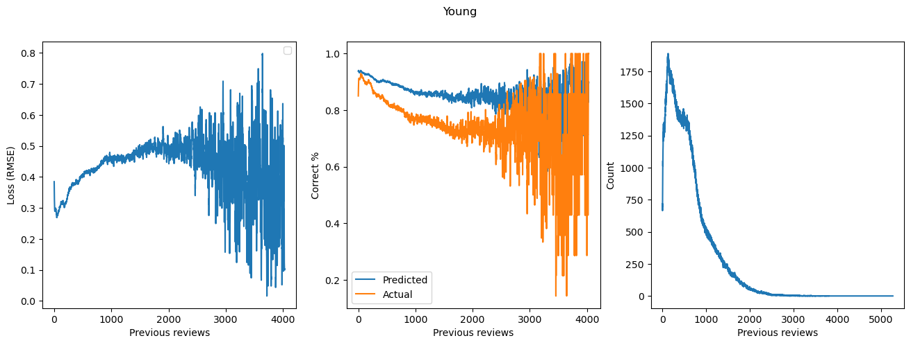
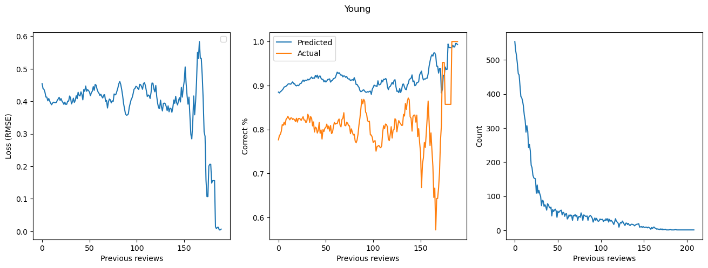

# FSRS RMSE Loss by previous reviews that day (fatigue)

[This](https://github.com/Luc-Mcgrady/Anki-Search-Stats-Extended/pull/25) Graph but for anki-10k

This seems to work for some users:

but for most (user with the median amount of reviews):

Theres hardly an effect, and the effect that does occur only occurs on days which the user does a lot more cards than average (very small sample size).
